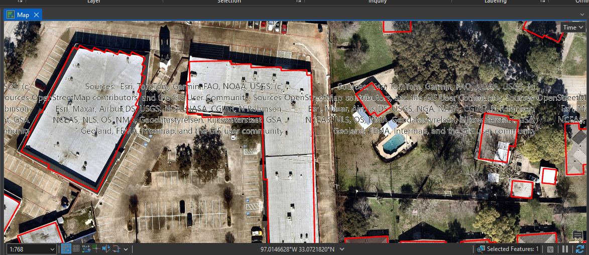
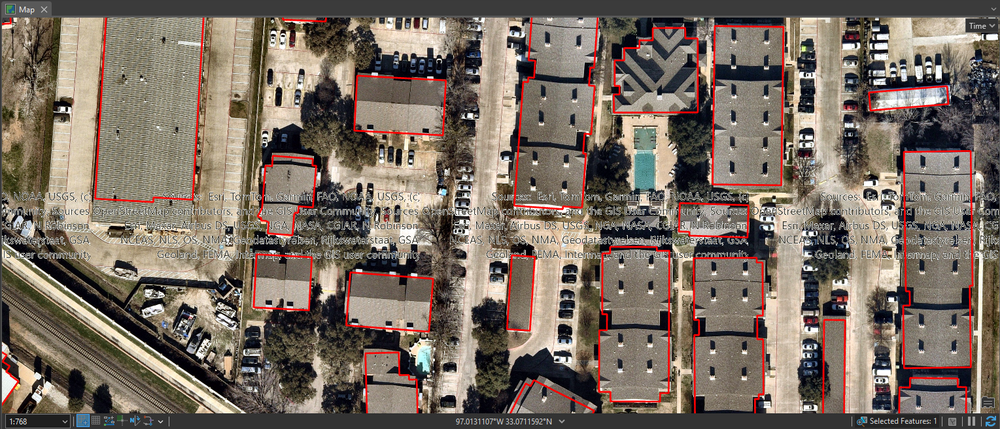

# Overview

Extract.py was originally written to run as a standalone script, but is now a collection of functions to be run in ArcGIS Pro for: 
- generation of a local raster file from an imagery service
- extraction of vector features from the local raster file. 

Current components include:
1. raster tile generation
2. stitching together a single raster (mosaic) from input raster tiles
3. extraction of building footprints (rooftops) using ESRI's pretrained model for buildings in the US (currently uses all default values for parameters of arcpy.geoai.ExtractFeaturesUsingAIModels())

# Data Preparation

If a suitable shapefile is not found in the 'vector' directory, in ArcGIS Pro or similar desktop GIS application:
1. Create fishnet (grid) using the desired projected coordinate system
- A vector grid that results in square raster tiles with pixel size that is a power of 2 may contribute to the performance of the mosaic process. Initial fishnet for entire city contained 1024 rows and columns.

2. If grid contains line features rather than polygon features, use geoprocessing tool 'Feature to Polygon'

3. Export only those polygon fishnet features that intersect the area of interest

# Usage

Close all other instances of ArcGIS Pro before running to minimize the risk of memory errors. 

Copy and paste functions into the Python window of ArcGIS Pro and call each one as needed. Key functions:

- generate_raster_tiles() - Generate raster tiles in tiff format from 'Map view' in and ArcGIS Pro project using fishnet layer. 
- generate_raster_tiles_via_layout() - Generate raster tiles in tiff format from 'Layout view' in and ArcGIS Pro project using fishnet layer - used in an attempt to remove attribution text from each raster tile, but with initial attempt, even without the text in the layout, tiles were generated with the text (function and/or use in ArcGIS Pro may need to be modified)
- mosaic_rasters() - stitch raster tiles together into a single raster file
- extract_building_footprints() - wrapper for arcpy.geoai.ExtractFeaturesUsingAIModels() function to extract building footprints from input raster

# Results

## Buildings

While the initial results are decent, attribution text on images seems to have caused some buildings to be fully or partially missed. 

# Recommendations

- attempt to remove the attribution text from input raster tiles
- modify the default parameters for arcpy.geoai.ExtractFeaturesUsingAIModels()
- attempt to train and/or refine a model using local imagery and compare the results to the use of ESRI's pre-trained models
- extract other features besides buildings 
